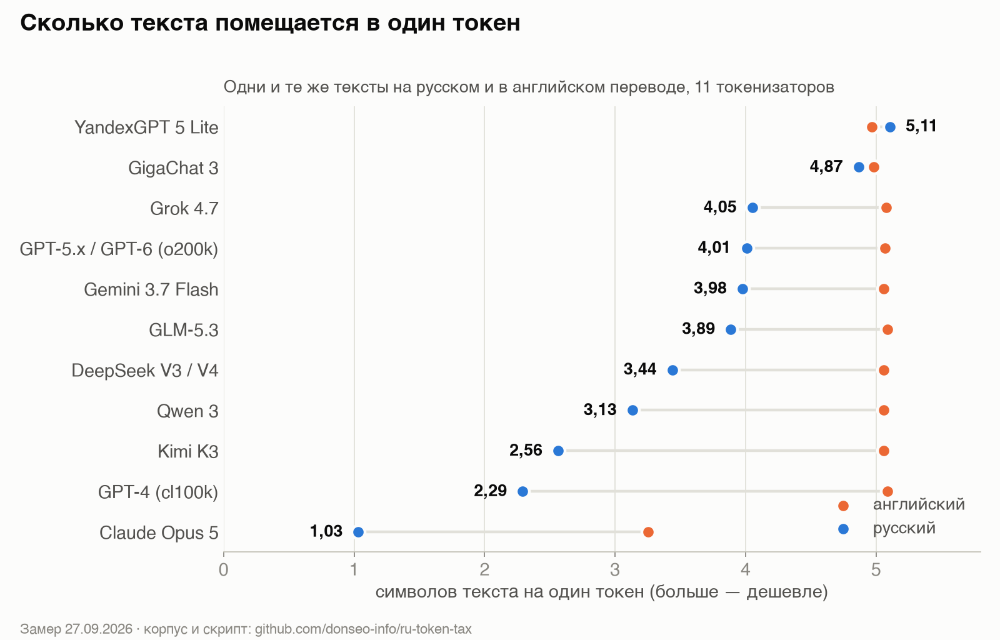
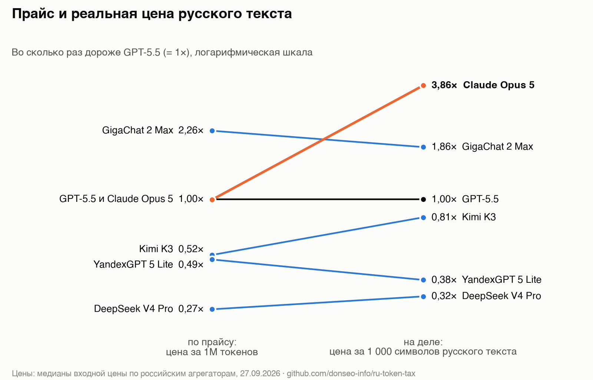

# ru-token-tax

Сколько токенов стоит русский текст в GPT, Claude, Gemini, DeepSeek, Qwen, GLM, Kimi, Grok, GigaChat и YandexGPT — корпус, скрипт замера, результаты.

Цена API публикуется за миллион токенов, но «токен» у каждой модели свой. Один и тот же русский текст в одной модели занимает в пять раз больше токенов, чем в другой. Поэтому сравнивать модели для русскоязычного продукта по прайсу за 1M токенов нельзя — нужно считать цену за символ или за типичный запрос.



## Результаты (27.09.2026)

Токены: русский / английский перевод. RU/EN и «символов на токен» — по трём прозаическим текстам, без кода.

| Токенизатор / модель | tech | chat | official | code | RU/EN | симв/ток RU | EN |
|---|---:|---:|---:|---:|---:|---:|---:|
| YandexGPT 5 Lite | 197 / 211 | 170 / 189 | 136 / 150 | 215 / 219 | 0,91 | 5,11 | 4,97 |
| GigaChat 3 | 215 / 212 | 176 / 186 | 137 / 150 | 202 / 200 | 0,96 | 4,87 | 4,98 |
| Grok 4.7 | 258 / 209 | 214 / 185 | 162 / 144 | 222 / 211 | 1,18 | 4,05 | 5,08 |
| OpenAI o200k (GPT-4o … GPT-6) | 260 / 209 | 208 / 185 | 173 / 145 | 214 / 198 | 1,19 | 4,01 | 5,07 |
| Gemini 3.7 Flash | 259 / 210 | 208 / 186 | 179 / 144 | 232 / 219 | 1,20 | 3,98 | 5,06 |
| GLM-5.3 | 270 / 209 | 205 / 185 | 186 / 143 | 216 / 196 | 1,23 | 3,89 | 5,09 |
| DeepSeek V3 / V4 | 296 / 209 | 250 / 186 | 201 / 145 | 225 / 203 | 1,38 | 3,44 | 5,06 |
| Qwen 3 | 324 / 209 | 259 / 185 | 237 / 146 | 231 / 196 | 1,52 | 3,13 | 5,06 |
| Kimi K3 | 382 / 209 | 336 / 186 | 284 / 145 | 245 / 197 | 1,86 | 2,56 | 5,06 |
| OpenAI cl100k (GPT-4, 3.5) | 422 / 209 | 377 / 185 | 322 / 143 | 258 / 196 | 2,09 | 2,29 | 5,09 |
| Claude Opus 5 | 872 / 327 | 830 / 285 | 785 / 228 | 424 / 231 | 2,96 | 1,03 | 3,25 |



Сырые числа — [`results.json`](results.json). Статья с разбором: *ссылка на Хабр*.

## Как повторить

```bash
python -m venv .venv && . .venv/bin/activate
pip install -r requirements.txt
./download_tokenizers.sh          # открытые токенизаторы с Hugging Face, ≈32 МБ
python measure.py                 # OpenAI, GigaChat, YandexGPT, DeepSeek, Qwen — локально
```

Закрытые модели — через любой OpenAI-совместимый API:

```bash
cp models.example.json models.json      # впишите модели, base_url и имя переменной с ключом
export LLM_API_KEY=...
python measure.py --api models.json
python charts.py                         # перерисовать графики
```

Для закрытых моделей скрипт считает токены по разнице двух запросов:

```
токены(текст) = usage("Ответь одним словом: ок.\n\n" + текст) − usage("Ответь одним словом: ок.")
```

Так вычитаются шаблон чата и системные промты, которые подмешивают шлюзы (мы видели от 130 до 3 350 лишних токенов на запрос). Проверка метода: для DeepSeek и GPT через API разница совпала с локальными токенизаторами до единицы.

Свой корпус — положите в `corpus/corpus.json` в том же формате: `{"жанр": {"ru": "...", "en": "..."}}`.

## Состав

| Файл | Что это |
|---|---|
| `corpus/corpus.json` | 4 пары параллельных текстов (техтекст, диалог поддержки, деловое письмо, код), написаны для замера |
| `measure.py` | Замер: локальные токенизаторы + закрытые модели через API |
| `charts.py` | Графики из `results.json` |
| `results.json` | Результаты замера 27.09.2026 |
| `download_tokenizers.sh` | Скачивает токенизаторы GigaChat 3, YandexGPT 5 Lite, DeepSeek V3, Qwen 3 |

## Ограничения

- Корпус небольшой (≈2 500 символов прозы на язык). Порядок моделей стабилен во всех жанрах, точные коэффициенты на ваших текстах будут отличаться на единицы процентов.
- Usage закрытых моделей получен через посредников. У одного из них для `claude-sonnet-5` и `claude-opus-4-8` usage совпал с `o200k_base` до единицы — эти данные помечены в `results.json` и в выводах не используются.
- Токенизатор GigaChat 2 закрыт; в расчётах цен использован открытый токенизатор GigaChat 3.

## Полезные ссылки

- [tiktoken](https://github.com/openai/tiktoken) — токенизаторы OpenAI
- [Подсчёт токенов в Claude](https://docs.anthropic.com/en/docs/build-with-claude/token-counting) — официальный бесплатный эндпоинт Anthropic
- [Подсчёт токенов в GigaChat API](https://developers.sber.ru/docs/ru/gigachat/api/reference/rest/post-tokens-count)
- [GigaChat 3](https://huggingface.co/ai-sage/GigaChat3-10B-A1.8B) и [YandexGPT 5 Lite](https://huggingface.co/yandex/YandexGPT-5-Lite-8B-instruct) на Hugging Face
- [Цены на API моделей у российских сервисов](https://ai-ping.ru/models) — откуда взяты цены для пересчёта

## Лицензия

MIT — код и корпус. Токенизаторы распространяются по лицензиям их авторов и в репозиторий не входят.
